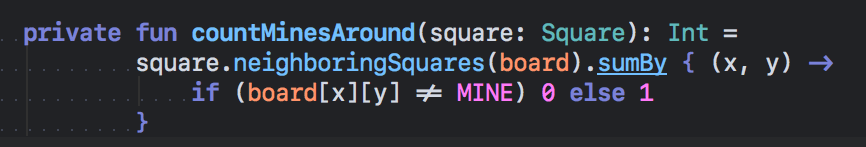
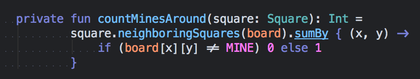

# Ligaturizer #


**Add ligatures to any coding font!**

**This repo contains 2 things:**
1.  Programming fonts with ligatures added (in `output-fonts/`), including:
  * [Anonymous Pro](output-fonts/Anonymous_Pro.ttf)
  * [CamingoCode](output-fonts/CamingoCode.ttf)
  * [Cousine](output-fonts/Cousine.ttf)
  * [DejaVu Sans Mono](output-fonts/DejaVuSansMono.ttf)
  * [Droid Sans Mono](output-fonts/DroidSansMono.ttf)
  * [edlo](output-fonts/edlo.ttf)
  * [Hack](output-fonts/Hack.ttf)
  * [Inconsolata](output-fonts/Inconsolata.ttf) &   [Inconsolata-g](output-fonts/Inconsolata-g.ttf)
  * IBM Plex Mono: [Regular](output-fonts/IBMPlexMono.ttf),   [Semibold](output-fonts/IBMPlexMono-SemiBold.ttf)
  * Meslo ([LGL](output-fonts/MesloLGL.ttf),   [LGLDZ](output-fonts/MesloLGLDZ.ttf), [LGM](output-fonts/MesloLGM.ttf),   [LGMDZ](output-fonts/MesloLGMDZ.ttf), [LGS](output-fonts/MesloLGS.ttf),   [LGSDZ](output-fonts/MesloLGSDZ.ttf))
  * [Oxygen Mono](output-fonts/OxygenMono.ttf)
  * [Roboto Mono](output-fonts/RobotoMono.ttf)
  * SF Mono: [Regular](output-fonts/SFMono.ttf),   [Semibold](output-fonts/SFMono-Semibold.ttf)
  * [Ubuntu Mono](output-fonts/UbuntuMono.ttf)

2.  A fontforge python script ([ligaturize.py](ligaturize.py)) that adds the ligatures from [Fira Code](https://github.com/tonsky/FiraCode) to a font without ligatures

Here's a couple examples of the fonts generated: SF Mono with ligatures (note the `!=` and `->`):  
  
  

**Credit**   
This awesome script was written by [IlyaSkriblovsky](https://github.com/IlyaSkriblovsky) for adding ligatures to Deja Vu Sans Mono ([dv-code-font](https://github.com/IlyaSkriblovsky/dv-code-font)). I made a few changes to generalize the script so that it works for any font, so that I could add ligatures to my favorite fonts.

## Requirements ##
**Using the Fonts**: See the [FiraCode README](https://github.com/tonsky/FiraCode) for a list of supported editors.

**Script**: This script requires FontForge python bindings. For Debian/Ubuntu they are available in `python-fontforge` package. For macOS,
they are available via brew (`brew install fontforge`).

## Using the Script ##
1.  Move/copy the font you want to ligaturize into `input-fonts/`
2.  Run the script: `$ fontforge -lang=py ligaturize.py`
3.  You'll be prompted for the name of the font, and the name for the generated font.
Example:

```shell
❯ fontforge -lang=py ligaturize.py
    ...
Enter the source font filename (including extension): RobotoMono-Regular.ttf
Enter a name for your ligaturized font -- or press ENTER to use the same name: <PRESS ENTER>
    ...
Generated ligaturized font Roboto Mono L in ligaturized-fonts/RobotoMono.ttf
```

```shell
❯ fontforge -lang=py ligaturize.py
    ...
Enter the source font filename (including extension): RobotoMono-Regular.ttf
Enter a name for your ligaturized font -- or press ENTER to use the same name: RobotoMonoL
    ...
Generated ligaturized font Roboto Mono L in ligaturized-fonts/RobotoMonoL.ttf
```

If you don't provide a name for the new font, it will have the same name as the input font.

## Misc. ##

For more awesome programming fonts with ligatures, check out:
1. [FiraCode](https://github.com/tonsky/FiraCode)
2. [Hasklig](https://github.com/i-tu/Hasklig)
